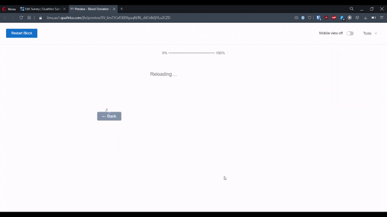

# List of Demos

1. Simulated Error:
   1. The page had three questions:
      1. Text: Shows text asking the respondents to wait for the website to load.
      1. Text: HTML iframe to create a box within which to show the website.
      1. Single Choice: Asks them what to when it fails.
   1. This is the flow:
      1. Hide Q2 and Q3 on the page. Just show text asking people to wait.
      1. After a pre-defined time, hide Q1.
      1. Wait just a short while (around 500 ms) and show Q2 and Q3. This ensures that the error message replaces the text and it doesn't have to move up.
      1. Below the error (Q2), Q3 is displayed, which asks them to choose.
      1. If they choose option 1 (which ideally they shouldn't in this case). The next button shows up, and the question text is changed.
      1. If they choose option 2, the question text changes, giving them an option to re-consider.
      1. If they choose option 3, they are automatically redirected to the next page.

  

