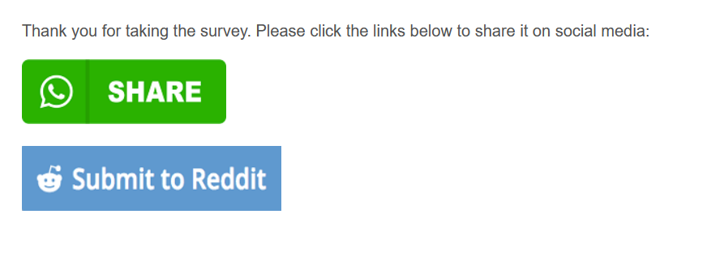

# Add Social Media Link in the Survey

This code allows you to add a hyperlink to an image in a Qualtrics survey.
My primary use case has been to create sharing buttons for social media platforms at the end of the survey.
<br><br>
[*Link to Working Demo*](https://iima.au1.qualtrics.com/jfe/preview/SV_2rCRZYIQqNq0nzv/BL_3gGWPq11mCxjo7H?Q_SurveyVersionID=current) 
<br><br>
*Screenshot*:



<br><br>

*Question Text*:<br>

Create a Descriptive Text Question with just some guiding text like: 
<pre style="color:grey">	Please click on the links below to share this survey on social media</pre>
<br>
*Question Javascript:*

```
Qualtrics.SurveyEngine.addOnReady(function () { 
	qid = "#" + this.questionId;

	fb = '<a href="https://facebook.com" target="_blank"><br><br></a>';

	li = '<a href="https://linkedin.com" target="_blank"><br><br></a>';
	
	tw = '<a href="https://twitter.com" target="_blank"><br><br></a>';
	
	rd = '<a href="https://reddit.com" target="_blank"><br><br></a>';

	document.querySelector(qid).insertAdjacentHTML('beforeend',fb);
	document.querySelector(qid).insertAdjacentHTML('beforeend',tw);
	document.querySelector(qid).insertAdjacentHTML('beforeend',li);
	document.querySelector(qid).insertAdjacentHTML('beforeend',rd);
});
```

<br><br><br>

 Notes:
 
 - The script below and the demo just take you to the social media site. To enable one-click sharing, you'll need to create *sharing* links. There are various sites you can use to create them.
 - BOTH attributes need to added:
 	- *href* refers to the URL where you want the participants to go
 	- *target : _blank* opens the link a new window. If you don't add this, the link opens in the same window and Qualtrics doesn't allow social media sites to load.