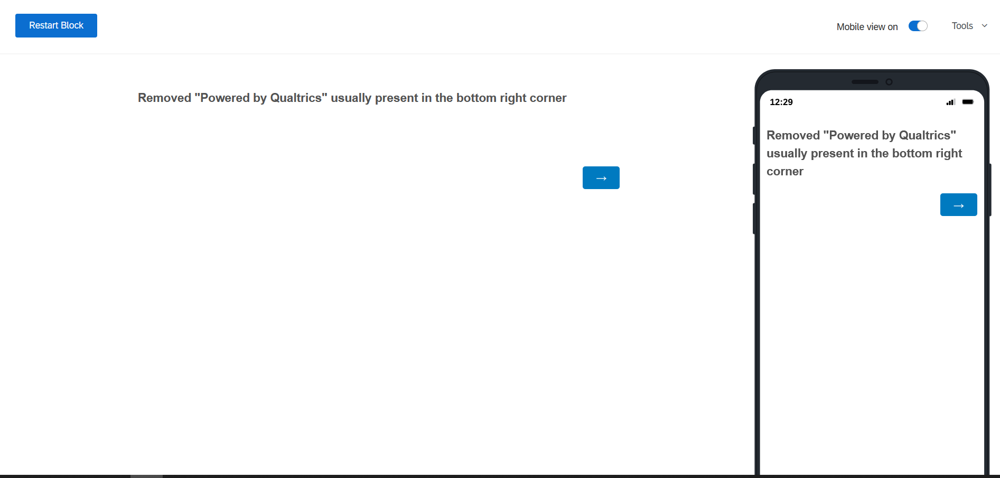

## Remove Powered by Qualtrics

This function allow you to remove the "Powered by Qualtrics", which is usually present in the bottom right corner on computer screens and bottom centre on mobile phones.

There are two ways to use the function. If you place it within the header (`Look and Feel --> General --> Header`), then it will across the survey. You can also use it on selected pages, by placing it the JS of any question on that page.

<br><br>
[*Link to Working Demo*](https://iima.au1.qualtrics.com/jfe/preview/SV_2rCRZYIQqNq0nzv/BL_50ayDWeUd6ErdeR?Q_SurveyVersionID=current) 
<br><br>

*Screenshot*:


<br><br>

*Javascript Code*:

If you use it in the header, then you need place it within the `script` tags as shown below.  
If you use in a question, you need to remove them.

```
<script>

Qualtrics.SurveyEngine.addOnReady(function()
{
        var plug = document.getElementById("Plug"); //Find "Powered By" on the page
        plug.style.cssText += ';display:none !important;'; //Set the defined element's display style to "none"

});

</script>
```