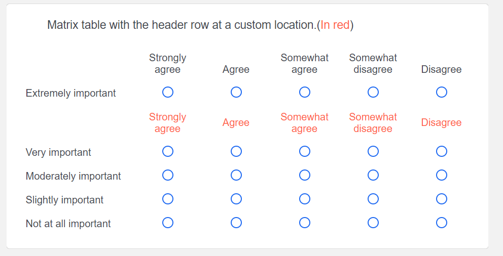

# Add Header Row to Matrix

This function allows one to add the matrix header row at a custom location in the matrix. While Qualtrics allows repeating the header row within the table, it only does so after 5 or so rows. By using this function, one can ensure the options are visible at all times. The script below is for adding the header as the 2nd row, but multiple rows can be added with slight modification.

[_Link to Working Demo_](https://iima.au1.qualtrics.com/jfe/preview/SV_2rCRZYIQqNq0nzv/BL_9Hnthujr7TA2LvD?Q_SurveyVersionID=current)  
Hold down Ctrl or ⌘ Cmd to open the link in a new tab

_Screenshot_:



_Question Javascript:_

```js
Qualtrics.SurveyEngine.addOnReady(function () {
	let choice_table = this.getChoiceContainer();

	//Numbering starts from 0. So the header is the 0th row, the first statement row 1 etc.
	//This will create an empty row above statement 4. YOu can change it accordingly.

	let new_row = choice_table.insertRow(2);

	//rows[0] refers to the header.
	// So this takes the header row fills up the empty row just created.

	new_row.innerHTML = choice_table.rows[0].innerHTML;
});
```
