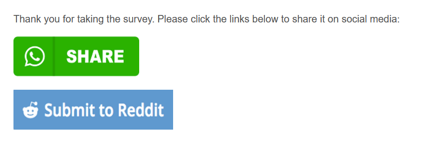

# Add Social Media Link in the Survey

This code allows you to add a social media hyperlink to an image in a Qualtrics survey. My primary use case has been to create sharing buttons for social media platforms at the end of the survey. Since Qualtrics blocks social media sites, some workaround is required.

The codes below contain links to the social media icons at this GitHub account. The best option for you is to upload your custom social media icons into Qualtrics and then use them. This will allow them to load faster and ensure they are always shown.

  
  
 [_Link to Working Demo_](https://iima.au1.qualtrics.com/jfe/form/SV_aaWPtD2N7WEQIXr)   
Hold down Ctrl or ⌘ Cmd to open the link in a new tab   
  
 _Screenshot_:



_Question Text_:  


Create a Descriptive Text Question with just some guiding text like:

```text
    Please click on the links below to share this survey on social media
```

_Question Javascript:_

```js
Qualtrics.SurveyEngine.addOnReady(function () { 
    let qid = "#" + this.questionId;
    let survey_link = encodeURI("${e://Field/Q_URL}");

    let wa_link = "https://api.whatsapp.com/send?text=survey_link";
    let rd_link = "https://www.reddit.com/submit?title=Awesome&newwindow=1&selftext=true&text=My awesome survey %0A Survey Link: survey_link";

    wa_link = wa_link.replace("survey_link",survey_link);
    rd_link = rd_link.replace("survey_link",survey_link);

    let rd_image = "https://raw.githubusercontent.com/tafakkur/use-files/main/reddit.png";
    let wa_image = "https://raw.githubusercontent.com/tafakkur/use-files/main/whatsapp.png";

    let wa = "<a href=\'" + wa_link + "\' target='_blank'><br><br></a>";
    let rd = "<a href=\'" + rd_link + "\' target='_blank'><br><br></a>";


    document.querySelector(qid).insertAdjacentHTML('beforeend',wa);
    document.querySelector(qid).insertAdjacentHTML('beforeend',rd);
});
```
<br>
<br>

**For End of Survey:**

```html
<script>
    let survey_link = encodeURI("${e://Field/Q_URL}");

    let wa_link = "https://api.whatsapp.com/send?text=survey_link";
    let rd_link = "https://www.reddit.com/submit?title=Awesome&newwindow=1&selftext=true&text=My awesome survey %0A Survey Link: survey_link";

    wa_link = wa_link.replace("survey_link",survey_link);
    rd_link = rd_link.replace("survey_link",survey_link);

    let rd_image = "https://raw.githubusercontent.com/tafakkur/use-files/main/reddit.png";
    let wa_image = "https://raw.githubusercontent.com/tafakkur/use-files/main/whatsapp.png";

    let wa = "<a href=\'" + wa_link + "\' target='_blank'><br><br></a>";
    let rd = "<a href=\'" + rd_link + "\' target='_blank'><br><br></a>";


    document.querySelector("#EndOfSurvey").insertAdjacentHTML('beforeend',wa);
    document.querySelector("#EndOfSurvey").insertAdjacentHTML('beforeend',rd);
</script>

Thank you for taking the survey. Please click the links below to share it on social media:<br><br>
```

**Notes:**

* The script below and the demo just take you to the social media site. To enable one-click sharing, you'll need to create _sharing_ links. There are various sites you can use to create them.
* BOTH attributes need to added:
  * _href_ refers to the URL where you want the participants to go
  * _target : \_blank_ opens the link a new window. If you don't add this, the link opens in the same window and Qualtrics doesn't allow social media sites to load.

