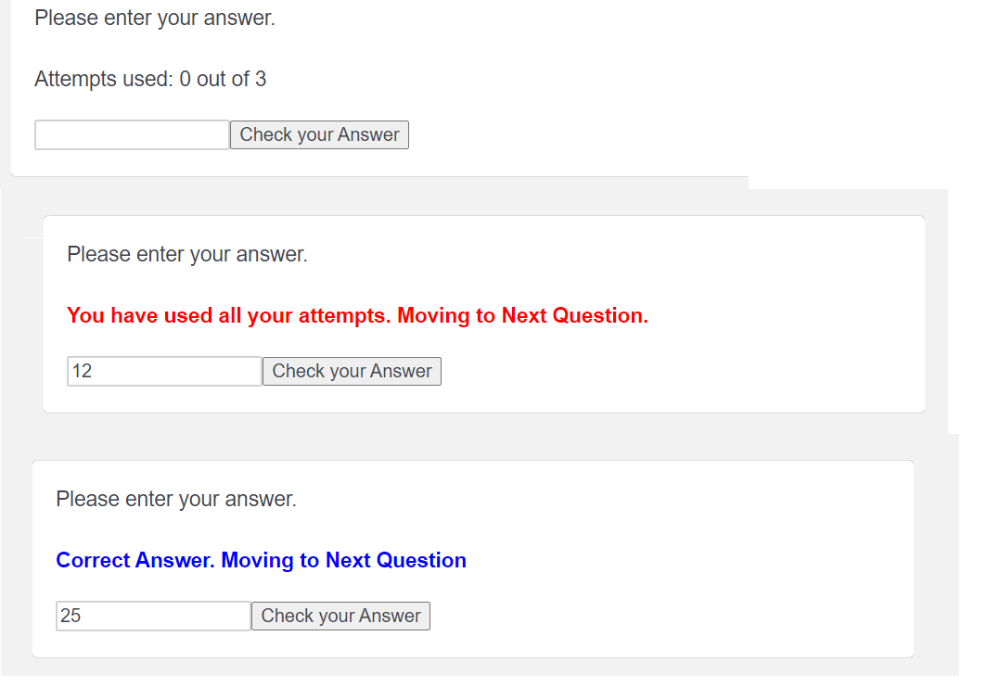

# Maximum Number of Attempts

This function allows you to specify a limit to the number of attempts a respondent has for getting the answer correct, before moving forward. This is especially useful for tests.  

The variable ```desired_answer``` corresponds to the correct answer and ```max_attempts``` corresponds to maximum number of attempts allowed. These can be changed in the code as required. 

If you do not want to show the number of attempts set the  ```show_attempt``` variable to ```0``` (*zero*).

  
 [_Link to Working Demo_](https://iima.au1.qualtrics.com/jfe/preview/SV_bd8Lv6cH7a3pJVb/BL_1Nug9eocGALKm8J?Q_SurveyVersionID=current)   
Hold down Ctrl or ⌘ Cmd to open the link in a new tab   
  
 _Screenshot_:



_Question Javascript:_

```
Qualtrics.SurveyEngine.addOnReady(function () {
	desired_answer = 25;
	max_attempts = 3;
	wrong_times = 0;
	show_attempt = 1;
	this.hideNextButton();
	this.hidePreviousButton();

	el = this.getChoiceContainer().querySelectorAll("input");
	this.getChoiceContainer().insertAdjacentHTML(
		"beforeend",
		"<div><br><br><button id='answer_check'>Check your Answer</button></div>"
	);

	btn = this.getChoiceContainer().querySelector("#answer_check");
	btn.onclick = check_answer;

	if (show_attempt) {
		this.getQuestionContainer().insertAdjacentHTML("beforeend", '<span id="atmpt" style="font-size: smaller;"></span>');
		atmpt = this.getQuestionContainer().querySelector("#atmpt");
	}

	that = this;
	function check_answer() {
		given_answer = 0;
		for(i=0;i<el.length;i++){
			//You can change this to calculate the given answer, as you with to calculate it.
			given_answer = given_answer + Number(el[i].value);
		}
		

		if (given_answer == desired_answer) {
			that.clickNextButton();
			btn.disable();
			el.forEach(item => item.disable());
		} else wrong_times += 1;
		if (wrong_times == max_attempts) {
			that.clickNextButton();
			btn.disable();
			el.forEach(item => item.disable());
		}

		if (show_attempt) update_attempt();
	}

	function update_attempt() {
		atmpt.innerHTML =
			"Attempts used:  " + wrong_times + " out of " + max_attempts;

		if (given_answer == desired_answer) {
			atmpt.innerHTML =
				"<b style='color:blue'>Correct Answer. Moving to Next Question</b>";
		}

		if (wrong_times == max_attempts) {
			atmpt.innerHTML =
				"<b style='color:red'>You have used all your attempts. Moving to Next Question.</b>";
		}
	}
});
```